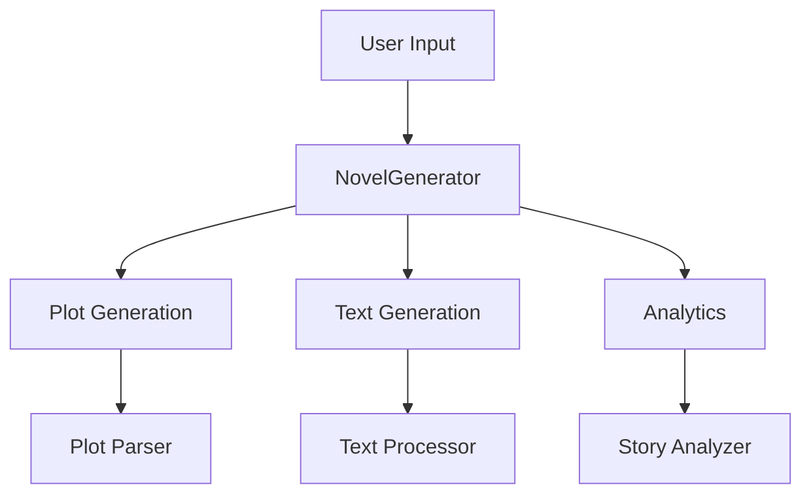

# NovelGenerator

<div align="center">


[](https://www.python.org/downloads/)
[](https://ollama.ai)
[](https://github.com/KazKozDev/NovelGenerator/blob/master/LICENSE)
[](https://github.com/KazKozDev/NovelGenerator/graphs/commit-activity)
[](https://github.com/KazKozDev/NovelGenerator/issues)
[](https://makeapullrequest.com)
[](https://github.com/psf/black)

<h2>AI-Powered Fiction Book Generator 📚</h2>

[Features](#-features) •
[Quick Start](#%EF%B8%8F-quick-start) •
[Installation](#-installation) •
[Usage](#-usage) •
[Examples](#-examples) •
[FAQ](#-faq) •
[Contributing](#-contributing)

</div>

## 🌟 Overview

NovelGenerator is a sophisticated Python tool that leverages advanced AI models to create complete novels. Using Ollama's large language models, it generates coherent plot structures, develops characters, and writes in multiple styles while providing analytical insights into the generated content.

### Key Benefits
- 🚀 Complete novel generation in minutes
- 🎨 Multiple writing styles support
- 📊 Advanced analytics and visualization
- 🔄 Real-time progress tracking
- 📝 Professional-grade output

## ⚡️ Quick Start

```bash
# One-line installation
curl -sSL https://raw.githubusercontent.com/KazKozDev/NovelGenerator/main/install.sh | bash

# Or clone and install manually
git clone https://github.com/KazKozDev/NovelGenerator.git
cd NovelGenerator

# Run directly
python3 novel_generator.py

# Or with arguments
python3 novel_generator.py --topic "Space Adventure" --chapters 5 --style cinematic
```

## 🔧 Installation

### Prerequisites
- Python 3.8+
- [Ollama](https://ollama.ai) installed

### Step-by-step Installation

1. Install Ollama:
```bash
curl https://ollama.ai/install.sh | sh
```

2. Pull required models:
```bash
ollama pull command-r:35b
ollama pull aya-expanse:32b
ollama pull qwen2.5:32b
```

3. Clone and setup NovelGenerator:
```bash
# Clone repository
git clone https://github.com/KazKozDev/NovelGenerator.git
cd NovelGenerator

# Create virtual environment
python -m venv venv

# Activate virtual environment
# On Windows:
.\venv\Scripts\activate
# On macOS/Linux:
source venv/bin/activate

# Install dependencies
pip install -r requirements.txt

# Download spaCy model
python -m spacy download en_core_web_sm
```

## 🚀 Features

### Writing Styles
- **Cinematic**: Visual and dynamic narration
  ```python
  generator = NovelGenerator(style=WritingStyle.CINEMATIC)
  ```
- **Lyrical**: Poetic and emotional prose
  ```python
  generator = NovelGenerator(style=WritingStyle.LYRICAL)
  ```
- **Dramatic**: Character-focused storytelling
  ```python
  generator = NovelGenerator(style=WritingStyle.DRAMATIC)
  ```
- **Minimalistic**: Concise and impactful writing
  ```python
  generator = NovelGenerator(style=WritingStyle.MINIMALISTIC)
  ```

### AI Models
| Model | Purpose | Features |
|-------|----------|-----------|
| command-r:35b | Primary Generation | Plot development, character creation |
| aya-expanse:32b | Enhancement | Style refinement, cliche detection |
| qwen2.5:32b | Analysis | Story metrics, quality assessment |

### Analytics Features
- Story structure analysis
- Character interaction mapping
- Emotional balance tracking
- Writing style consistency check
- Quality metrics visualization

## 📖 Usage

### Basic Usage
```python
from novel_generator import NovelGenerator, WritingStyle

# Initialize generator
generator = NovelGenerator(writing_style=WritingStyle.CINEMATIC)

# Generate a book
book = generator.generate_book(
    topic="Space Adventure",
    chapter_count=5
)
```

### Command Line Usage
```bash
# Basic usage
python3 novel_generator.py

# With arguments
python3 novel_generator.py --topic "Space Adventure" --chapters 5 --style cinematic
```

### Advanced Configuration
```python
# Custom configuration
generator = NovelGenerator(
    writing_style=WritingStyle.DRAMATIC,
    primary_model="command-r:35b",
    enhancement_model="aya-expanse:32b",
    analyzer_model="qwen2.5:32b"
)

# Generate with specific parameters
book = generator.generate_book(
    topic="Mystery in Victorian London",
    chapter_count=10,
    min_words_per_chapter=3000,
    max_words_per_chapter=5000
)
```

## 📊 Examples

### Generated Book Sample
<details>
<summary>Click to expand</summary>

```markdown
# The Stellar Expedition
## Chapter 1: The Launch

The gleaming hull of the Stellar Pioneer reflected the early morning sunlight...
```
</details>

### Analytics Visualization


## 🔍 Troubleshooting

### Common Issues

1. Model Loading Errors
```bash
Error: Failed to load model 'command-r:35b'
Solution: Ensure Ollama is running: ollama serve
```

2. Generation Errors
```bash
Error: Generation failed
Solution: Check network connection and Ollama server status
```

## 🛠 Architecture



## 🔒 Security

- Input validation implemented
- No sensitive data storage
- Safe file operations
- Rate limiting on API calls

## 📝 Contributing

We welcome contributions! Please see our [Contributing Guidelines](CONTRIBUTING.md) for details.

### Development Setup
```bash
# Install development dependencies
pip install -r requirements-dev.txt

# Check code style
black .
pylint novel_generator
```

## ❓ FAQ

<details>
<summary>Q: How long does it take to generate a book?</summary>
A: Generation time varies depending on chapter length, complexity, and system resources.
</details>

<details>
<summary>Q: Can I use the generated content commercially?</summary>
A: Yes, but we recommend thorough review and editing before commercial use.
</details>

## 📫 Support and Contact

- [Report a Bug](https://github.com/KazKozDev/NovelGenerator/issues/new?labels=bug)
- [Request a Feature](https://github.com/KazKozDev/NovelGenerator/issues/new?labels=enhancement)
- [Ask a Question](https://github.com/KazKozDev/NovelGenerator/issues/new?labels=question)

## 📜 License

This project is licensed under the MIT License - see the [LICENSE](LICENSE) file for details.

## 👏 Acknowledgments

- [Ollama](https://ollama.ai) for AI models
- [spaCy](https://spacy.io) for NLP processing
- [Rich](https://github.com/Textualize/rich) for terminal UI
- Community contributors

---
<div align="center">
Made with ❤️ by KazKozDev

[GitHub](https://github.com/KazKozDev) • [Report Bug](https://github.com/KazKozDev/NovelGenerator/issues/new?labels=bug) • [Request Feature](https://github.com/KazKozDev/NovelGenerator/issues/new?labels=enhancement)
</div>